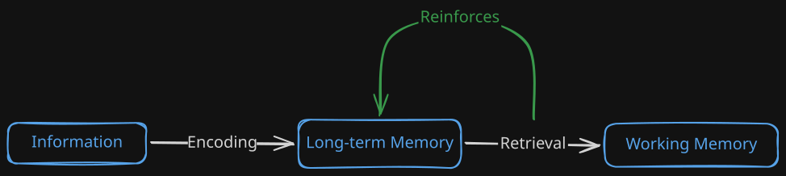

You want to learn something, maybe you want to learn a lot of things, but how? What's the most effective strategy to learn any kind of knowledge or skill? I will try to develop that strategy in this guide, that briefly consist of:

> Plan → Pre-study → Encode → Retention

I will not develop new ideas or frameworks here. Everything I know comes from people like [Justin Sung](https://www.youtube.com/channel/UC2Zs9v2hL2qZZ7vsAENsg4w) and books from [Peter C. Brown](https://www.amazon.com/Make-Stick-Science-Successful-Learning/dp/0674729013), [Scott H. Young](https://www.amazon.com/Ultralearning-Essential-Mastering-Skills-Future-Proofing/dp/006285268X) and [Barbara Oakley, Beth Rogowsky and Terrence J. Sejnowski](https://www.amazon.com/Uncommon-Sense-Teaching-Practical-Insights/dp/0593329732).

Before discussing the strategy, you need to know that little in this guide will work for you if you don't have the correct fundamentals of self-management, productivity, and good personal systems set up. Things like time management, task prioritization, concentration, and critical reflection.

## 1. Plan

First of all, what do you want to learn, specifically? You need to gather the best resources and techniques available to you about your topic. Find the best learning process for your topic or area.

A good rule of thumb for how much time you should invest in this:

> Spend 10% of the time you plan to learn something on exploring how to do it effectively.

Also remember, this is not a one-time task; you will update your techniques at the same time you find new obstacles and opportunities that weren't clear at the beginning.

Ask yourself three questions:

- **Why do I want to learn this?**
- **What is it that I want to learn?**
- **How am I going to learn it?**

The first question serves as the motivation as well as the clarification of your goals and objectives. Let's say you want to learn how to code for doing a simple personal web page, you'll find out that there are tools and techniques that allow you to accomplish that same result without the need to learn how to code. That's the importance of having your goals crystal clear.

For the second question, you will list all the concepts, facts and procedures you need to understand, memorize and learn in order to achieve your objetives. The length of each list should vary depending on your objetives. If you plan to learn moral philosophy, the concept list will dominate the other two. If what you have in mind is learning to play chess, the procedures section will be the longest. So, don't worry about exhausting every fact, concept or procedure of your domain, focus on your goals.

The third and last question is probably the one that will pay off the most. Find the most efficient methods to master your area of interest. Search the syllabus of universities like MIT, Harvard, Yale and Stanford; search the experiences and advice of people who already mastered the skill or knowledge you want.

Once you've planned, you are ready to start skimming.

## 2. Pre-study

Now that you have the why, what and how, it's time to develop a superficial understanding of your topic.

Survey the syllabus you just made, identify key concepts and their relations without going into detail.

> Establish the skeleton, the fundamental structure of your topic before delving into it.

Mind maps are key in this step. Relate each concept with each other graphically, and identify the kind of relation they have. A simple example we will see later:

Here we identify the kind of relation (encoding, retrieval) for each concept (Information, LT memory, working memory), note that the relations are concepts in themselves too.

In doing this, we use the **priming** effect to our advantage. You've now warmed up your brain. Time to actually learn.

## 3. Encode

Now comes the fun part. Actually start learning by deep diving into the material.

We make use of the concept of **encoding**. This is what your brain naturally does when it tries to comprehends and understand the knowledge.

> A key to remember is that this process produces **cognitive load**. This feels like an actual pressure in your head, a sense of frustration like "I don't get it". Don't worry, you will get used to this and eventually you won't even bother, but it is useful to keep it as an indicator for whether you are actually learning or just fooling yourself.

Encoding is practiced through the **encoding cycle**:

1. **Simplify**: Are you capable of explaining this to someone in an easy way? Can you derive the entire logic from memory? Do it.
2. **Compare**: How is this similar to the other? How is it different? Why is it better or worse? Answer.
3. **Connect**: How does this interacts with what you already know? How it relates to prior concepts?
4. **Group**: Can you organize the concepts in a way that their structure and relation seem obvious? Form new high-level concepts grouping others.

These steps make the process of encoding seem more rigid than it truly is. If you are a beginner it is useful to pass through each one of this steps, actually asking the questions; and when you gain more experience in the learning process, your brain will do the process automatically.

Now, the most practical section of the entire post. You can try to organize your study sessions using **deep work** (just turning off your distractions and giving it your full attention) like this:

- **Block 1: Retrieval** (20 min)
- **Block 2: New material + Encoding** (90-240 min)
- **Block 3: Preview** (15-20 min)

Block 1 is for reconstructing the core of your last session from memory, practicing retrieval and priming in a single shot:

- Make a quick mind map of the concepts and relations you remember
- Derive the equations
- Explain concepts in plain language
- DON'T look at your notes until you've tried. This surfaces gaps immediately

Block 2 is for actually studying the new material. You can read/watch it, but don't just consume. Split this block into several mini-sections like:

- For every 20-30 minutes of input (reading, watching), stop and do 10 minutes of encoding
 	- simplify it
 	- compare it to something you already know
 	- connect it to adjacent concepts
 	- group it in a mind map
 	- identify **knowledge gaps** (concepts, techniques, facts you don't fully understand or don't get into your memory)

Block 3 is for skimming the next topic, also priming your brain. When you come back to it, it won't feel completely new.

You've now encoded the material. What else should you do?

## 4. Retention

Obviously, it is important to actually retain the knowledge and skills we learn. But here's the catch:

> The better the encoding, the better the retention.

You should concentrate your efforts on actually learning the topic, and understanding it right. But there are times in which this is not possible. For those occasions, you can try **retention techniques** and, in my opinion, the most effective is: **Flashcards** + **Spaced Repetition**: Use apps like [Anki](https://apps.ankiweb.net/) (available for PC, Android and iOS) to make your own flashcards, question-answer practice cards that appear just when you start to forget the info.

You can use this for facts, formulas, key info, etc. But don't try to replace encoding with this; flashcards are not for understanding, but for memorization.

Also, the default configuration for Anki is kind of sub-optimal, so if you plan to get serious with it, I recommend tuning yours for a better spaced repetition algorithm. You can follow a simple guide like [this](https://www.youtube.com/watch?v=uo-qQvOZDfg).

## End note

And that's it. Plan → Pre-study → Encode → Retention.

This is a very brief and ready-to-use guide. If you want to learn more or improve your learning skills beyond the superficiality of this post, I highly suggest you to view the resources I mention at the beginning.

Learning skills, like any other skill, is a matter of intelligent and deliberate practice. You will find a lot of challenges on your way to mastering your desired topics and skills, and you'll come up with ingenious techniques and methods to overcome them.

Put intelligent effort into it, and trust the process.
